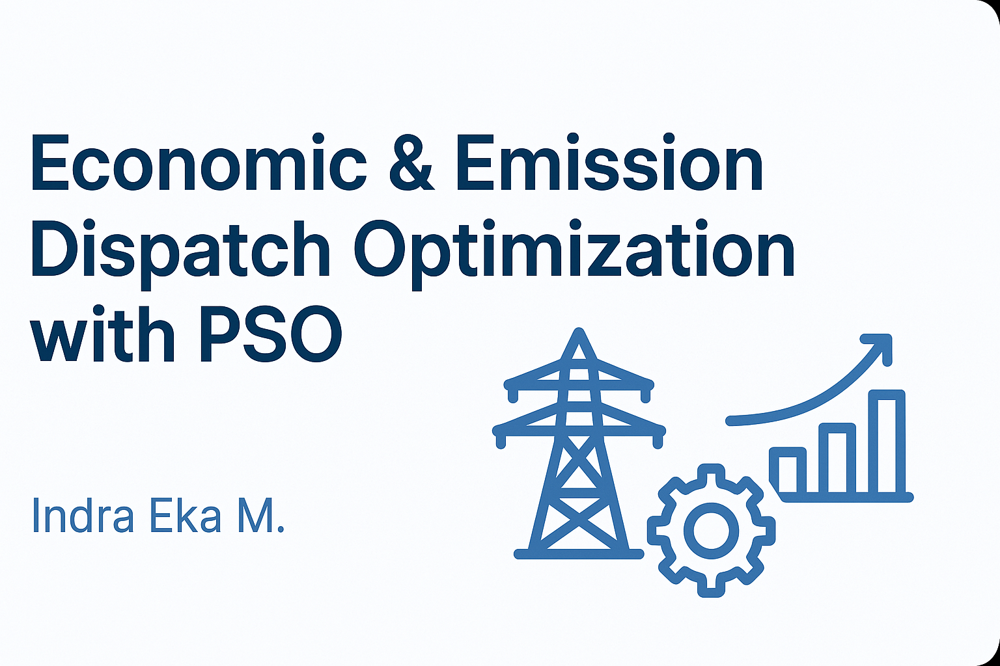

# ⚡ Economic & Emission Dispatch Optimization using PSO (MATLAB)

This project models and solves **Economic Dispatch** and **Emission Dispatch** optimization for the **JAMALI power grid (Java-Madura-Bali)** using the **Particle Swarm Optimization (PSO)** algorithm in MATLAB.

---

---

## 🎯 Objective

- Minimize total **fuel cost** (Economic Dispatch)
- Minimize total **emission** (Emission Dispatch)
- Or optimize both (Combined Dispatch)
- Meet load demand while satisfying generator constraints

---

## ⚙️ Model Types

1. **Economic Dispatch Only**
2. **Emission Dispatch Only**
3. **Combined Economic-Emission Dispatch**

Each model uses the same PSO framework with different objective functions.

---

## 🧾 Inputs & Outputs

- **Input**: Total power demand (in MW)
- **Output**:
  - Generator power allocations (MW)
  - Total fuel cost and/or emission value
  - Convergence curve of PSO

---

## 🚀 How to Run

1. Open in **MATLAB R2020**
2. Run one of the `fixEco.m`, `fixEmi.m`, `fixEcoEmi.m` scripts based on optimization mode
3. Enter desired power demand
4. Review power distribution per generator and total objective value

---

## 👨‍💻 Author

**Indra Eka Mandriana S.Kom**  
_Researcher in Power Systems Optimization & AI Algorithms_

---

## ⭐ Support the project by giving it a ⭐!
